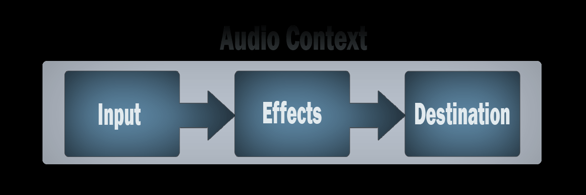

# Web Audio API
- Provides a powerful and versatile system for controlling audio on the web
- allowing devs to choose audio sources, add effects, create audio visualisations, apply spatial effects, ...

## Concepts and Usage
- The API involves handling audio operations inside an audio context
- Designed to allow modular routing
- Basic audio operations performed with audio nodes
    - Linked together, they form an audio routing graph
- Several sources - with diff types of channel layout - are supported (even within a single context)

### Audio Nodes
- Linked together into chains/simple webs by their inputs and outputs
- Typically start with one or more sources
    - Sources provide arrays of sound intensities (samples) at very small timeslices, often tens of thousands of them 
      per second
        - Computed mathematically (`OscillatorNode`)
        - recordings from sound/video files (`AudioBufferSourceNode`, `MediaElementAudioSourceNode`) and audio streams 
          (`MediaStreamAudioSourceNode`)
          
- Outputs can be linked to inputs of others
    => mix/modify streams of sound samples into different streams
    - common modification: make them louder ow quieter (`GainNode`)
    
### Simple workflow
1. Create audio context
2. Inside the context, create sources — such as `<audio>`, oscillator, stream
3. Create effects nodes, such as reverb, panner, compressor
4. Choose final destination of audio, for example your system speakers
5. Connect the sources up to the effects, and the effects to the destination.  

Timing is controlled with high precision and low latency, allowing developers to write code that responds accurately to 
events and is able to target specific samples, even at a high sample rate. So applications such as drum machines and 
sequencers are well within reach.

### Modular routing
- Allows arbitrary connections between different `AudioNode` objects
- Each node can have inputs and/or outputs
- A source node has no inputs and 1 output
- A destination node has 1 input and no outputs
- Other nodes such as filters can be placed between the source and destination nodes
- You do not have to worry about low-level stream formats when 2 objects are connected together
    - Mono audio stream connects to a stereo input
        => should mix left and right channels appropriately

## Target Audience
- Web Audio API can seem intimidating to those that aren't familiar with audio or music terms
- As it incorporates a great deal of functionality it can prove difficult to get started
- It can be used to incorporate audio into your website or application
- However, it can also be used to create advanced interactive instruments
=>  it is suitable for both developers and musicians alike
